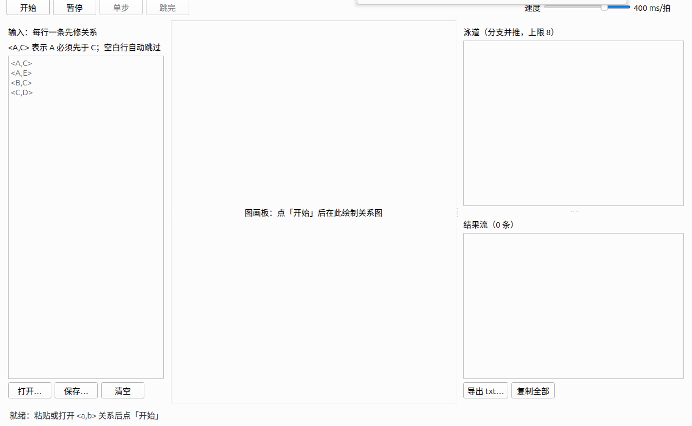

# 拓扑排序应用软件 项目报告

> 高级算法原理实践 · CST4823A · 汕头大学数计学院计算机系
> 版本 1.0 · 2026-09-23
> 组别：第一组
> 学生：黄应辉（2024611031）、徐锦源（2024611176）、罗展彬（2024611093）、郑逸驰（2024611021）、冯思语（2024611197）
> 指导老师：廖海泳、陈银冬

---

## 分工描述

| 姓名（学号） | 职责 | 主要工作 |
|---|---|---|
| 黄应辉（HandyWote）<br>2024611031 | **组长** | 总体架构与进度把控；包骨架与 CI 三平台矩阵（T1）；模块接口契约定稿；集成联调与中期演示（T6）；三端打包发布与 GitHub Release（T7）；01-可行性研究报告；提交材料组装 |
| 徐锦源（Asukadaisiki）<br>2024611176 | **models 开发者** | 算法内核 `app/models/`：`<a,b>` 解析与容错、不可变图结构、最长路径分层、Kahn 显式栈回溯全序枚举、环检测（全部自研）；03-概要设计主责 |
| 罗展彬（xiaoliei）<br>2024611093 | **events 开发者** | 事件引擎 `app/events/`：六类 StepEvent 协议、Kahn 步进内核、伪并发时间线（tick 交错/暂停/单步/调速/泳道上限）、golden 事件流；05-测试报告主责 |
| 郑逸驰（HanXuXie）<br>2024611021 | **scene 开发者** | 渲染场景 `app/scene/`：分层画布 `GraphBoard`、动画效果 `Effects`、候选池芯片 `CandidatePool`、PNG 导出 |
| 冯思语（Frieda-Feng）<br>2024611197 | **ui 开发者** | 界面壳 `app/ui/`：三栏主窗口、输入面板、控制条、泳道面板、结果流、两类错误提示；02-需求分析与 06-用户手册主责；00-项目报告组装 |

> 详细任务拆分与依赖关系见 `evidence/decisions/2026-09-15-任务拆分总表.md`。

---

## 修订历史记录

| 日期 | 版本 | 说明 | 作者 |
|---|---|---|---|
| 2026-09-15 | 0.1 | 技术栈定案（Python+PySide6+PyInstaller）、模块接口契约定稿、包骨架与 CI 三平台矩阵就位 | 黄应辉（2024611031） |
| 2026-09-18 | 0.2 | 算法内核完成；发现并修正标准图拓扑序基准（6 条 → 7 条） | 徐锦源（2024611176） |
| 2026-09-19 | 0.3 | 事件引擎完成（含确定性保证与规模防护）；渲染场景完成；概要/详细设计初稿就位 | 罗展彬（2024611093）、郑逸驰（2024611021） |
| 2026-09-20 | 0.4 | 界面壳完成；四模块集成联调打通；中期检查演示彩排通过 | 冯思语（2024611197）、黄应辉（2024611031） |
| 2026-09-21 | 0.9 | 三端打包发布完成，产物发布至 GitHub Release v0.1.0 | 黄应辉（2024611031） |
| 2026-09-23 | 1.0 | 交付文档补齐（可行性研究、测试报告）；提交材料组装 | 全组 |

---

## 1. 软硬件环境

### 1.1 开发环境

| 项目 | 配置 |
|---|---|
| 操作系统 | Ubuntu 24.04.5 LTS（x86_64）、macOS |
| 编程语言 | Python 3.11.16 |
| GUI 框架 | PySide6 6.11.2（Qt 6） |
| 打包工具 | PyInstaller 6.22.3 |
| 测试框架 | pytest |
| 依赖与工程管理 | uv（依赖唯一入口，`uv.lock` 锁定版本） |
| 版本控制 | Git + GitHub |
| 持续集成 | GitHub Actions（ubuntu-latest / macos-latest / windows-latest 三平台矩阵） |

### 1.2 运行环境

程序**三端通用**（Windows / macOS / Linux），交付产物为已打包的可执行文件，
**目标机无需安装 Python 或任何依赖库**：

| 平台 | 产物 | 体积 | 打包模式 |
|---|---|---|---|
| Linux x64 | `TopoSort` | 64.0 MB | 单文件 |
| Windows x64 | `TopoSort.exe` | 46.5 MB | 单文件 |
| macOS | `TopoSort-macos.zip`（内含 `TopoSort.app`） | 35.0 MB | 目录包 |

三份产物均已发布至 GitHub Release（v0.1.0），每个产物附同名 `.sha256` 校验文件。
运行说明与常见问题见交付包中的 `readme.txt`。

### 1.3 开发工具链约定

- 依赖只从 `pyproject.toml` 声明，`uv.lock` 锁定；禁止裸 `pip install`。
- 路径一律使用 `pathlib`；文件读写显式指定 `encoding='utf-8'`；
  写文件使用 `newline=''`——保证三端行为一致。
- CI 机械检查上述红线：`app/models` 与 `app/events` 导入后不得出现 PySide6/PyQt。

---

## 2. 需求分析

> 完整内容见 `deliverables/02-需求分析.md`（功能需求 22 条 + 非功能需求 7 条 + 需求追踪矩阵）。

### 2.1 功能需求（摘要）

| 编号 | 需求（摘自 `deliverables/02-需求分析.md`） | 优先级 |
|---|---|---|
| FR-01 | 支持在界面文本框中**手工输入**关系，一行一条，西文尖括号格式 `<a,b>` | P0 |
| FR-02 | 支持从**文本文件导入**关系；文件编码为 UTF-8 | P0 |
| FR-03 | 输入容错：空白行自动跳过；全角括号 `（）`、全角/半角逗号、省略尖括号的 `a,b` 均可接受 | P1 |
| FR-04 | 重复关系自动去重，不影响结果 | P0 |
| FR-05 | 输入非法时给出**明确错误提示并指明行号** | P0 |
| FR-15 | 分支数量超过泳道展示上限时，超出部分不单独展示但**仍照常计入结果**，并给出提示 | P1 |
| FR-16 | 列出**尽可能多**的合法拓扑序，每条一行、空格分隔 | P0 |
| FR-17 | 结果数量很大时按上限截断，并显示实际条数，**界面不得卡死** | P0 |
| FR-20 | 检出**环**时给出明确提示，列出处于环上的节点，说明不存在拓扑序（不得崩溃、不得给出错误结果） | P0 |
| FR-22 | 自环 `<A,A>` 视为非法输入并报错 | P0 |

### 2.2 非功能需求（摘要）

| 编号 | 需求（摘自 `deliverables/02-需求分析.md`） | 验收方式 |
|---|---|---|
| NFR-01 | **三端通用**：Windows / macOS / Linux 均可运行，代码不得使用平台专属 API（路径用 `pathlib`，读写显式 UTF-8） | CI 三平台矩阵验证 |
| NFR-02 | **算法原创**：Kahn 排序、全序枚举、环检测均自行实现，不使用现成图论库的排序结果 | 课程考核点 |
| NFR-03 | **性能**：30–60 节点稀疏图在「极速模式」（关闭动画）下应在数秒内给出结果或计数 | 见 `evidence/benchmarks.csv` |
| NFR-04 | **可维护**：分层架构，算法层（models/events）**零 GUI 依赖**且可独立测试；模块间依赖单向 | CI 机械断言 |
| NFR-05 | **界面可用**：窗口默认 1280×800，三栏布局；动画流畅不卡顿；错误提示可见且指出原因 | 见 `deliverables/06-用户手册.md` |
| NFR-06 | **可交付**：单文件可执行程序，三端各一份；目标机器无需安装 Python 环境 | 见第 1.2 节 |
| NFR-07 | **可追溯**：每项决策留档于 `evidence/decisions/`，每个可见功能配截图，测试输入存 `evidence/test-data/` | 项目规范 TOP RULE |

---

## 3. 详细设计

> 完整内容见 `deliverables/03-概要设计.md` 与 `deliverables/04-详细设计.md`。

### 3.1 类设计

系统按**四层单向依赖**组织：`ui → scene → events → models`，禁止反向与跨层依赖；
`models` 与 `events` **零 Qt 依赖**（CI 强制检查）。

```
┌─────────────────────────────────────────────────────┐
│ ui/      界面层：主窗口/输入面板/控制条/泳道/结果流     │
├─────────────────────────────────────────────────────┤
│ scene/   渲染层：画布/动画/候选池；只认事件，不懂算法   │
├─────────────────────────────────────────────────────┤
│ events/  事件层：算法→确定性事件流 + 伪并发时间线      │
├─────────────────────────────────────────────────────┤
│ models/  逻辑层：解析/图结构/Kahn/全序枚举/环检测      │
└─────────────────────────────────────────────────────┘
```

| 模块 | 主要类 / 函数 | 职责 |
|---|---|---|
| `models/parser.py` | `ParseError`、`parse()` | 文本解析、去重边、拒绝自环；错误携带行号与原文 |
| `models/graph.py` | `Graph`、`CycleError` | 不可变图结构（`frozenset` 节点集与边集）、公共查询 |
| `models/enumerator.py` | Kahn 分析、显式栈搜索 | 入度与最长路径层号计算、稳定枚举或仅计数全部拓扑序 |
| `events/protocol.py` | `Enqueue` / `Consume` / `Fork` / `Complete` / `DeadEnd` / `CycleFound`（六个 `@dataclass(frozen=True)`）与联合类型别名 `StepEvent` | 六类事件的**唯一定义处** |
| `events/player.py` | `TopoPlayer` | 步进内核：显式分支工作队列 → 确定性事件流 |
| `events/timeline.py` | `Timeline` | 伪并发调度：tick 交错、暂停/单步/调速、泳道上限 |
| `scene/board.py` | `GraphBoard(QGraphicsView)` | 分层图元布局、平移缩放、事件驱动的视觉状态更新 |
| `scene/effects.py` | `Effects` | 动画集中管理（`GHOST_MS=300`、`PULSE_MS=250`、`EDGE_DIM_MS=200`） |
| `scene/pool.py` | `CandidatePool` | 候选池芯片动画、`export_png()` |
| `ui/main_window.py` | `MainWindow` | 组装与信号槽接线、输入/控制/结果呈现、错误对话框 |

**不可变性设计**：`Graph.nodes` 与 `Graph.edges` 使用 `frozenset`，算法运行时只用局部
邻接表、入度表与栈帧，**不修改图对象**——因此同一个 `Graph` 可被重复播放并得到确定结果。

### 3.2 核心流程描述

```
用户输入文本
    │
    ├─→ parse() ──→ Graph ─┬─→ layers() ──────────────→ 画布静态分层布局
    │                      │
    │                      └─→ TopoPlayer ─→ Timeline ─→ 每拍事件列表
    │                                            │              │
    │                                            │              ↓
    │                                            │      scene.apply_event()
    │                                            │      节点状态迁移 + 动画
    │                                            ↓              ↓
    │                                    Complete 累积 ──→ 结果列表 / 导出 txt
    │
    └─→ ParseError（报行号）或 CycleFound（报卡住节点）→ 错误提示
```

**节点视觉状态机**：
`idle`（待命）→ `ready`（入候选池）→ `active`（本拍被选中，蓝色脉冲）→
`ghost`（被消费，保留原位半透明以留存过程轨迹）；异常态 `stuck`（红色）。

### 3.3 核心算法设计

本项目的三个算法**全部自研**（作业考点，禁用 networkx 等现成排序库）。

#### 3.3.1 Kahn 拓扑排序与分层

预处理阶段由边集构造按节点名排序的邻接表并计算入度，零入度节点构成初始候选集。
处理节点 `u` 时，对每条边 `u→v` 执行 `layer[v] = max(layer[v], layer[u]+1)`
并令 `indegree[v] -= 1`。扫描结束后：

- 所有节点均已释放 → 图无环，**层号即从源点出发的最长路径长度**（用于固定布局）；
- 仍有节点未释放 → 存在环，剩余节点入度均 ≥1。

分层是拓扑排序的副产品，因此**不需要引入自动布局库**——这是本项目技术选型的
关键洞察（详见 `deliverables/01-可行性研究报告.md` 3.1 节）。

#### 3.3.2 全序枚举（核心考点）

难点在于"枚举**全部**合法序"而非只求一条。朴素递归会重复展开。本项目采用
**Kahn 步进 + 显式分支工作队列**：

- 某一步候选 frontier 有 k 个节点时，原分支按**字典序**选最小者继续（`Consume`），
  其余 k−1 个备选**各开一条新分支**（`Fork`）；
- **新分支首次推进必须消费其 Fork 时绑定的备选节点**，不重新自选——否则所有分支
  会收敛到同一条序（该结论经模拟证明：只有"绑定备选"解读才得到 7 次 Complete）。

每条分支恰好对应一条合法序，不重复、不遗漏。

**正确性经独立复核**：实现输出标准图有 7 条序，与既有基准（6 条）冲突；
通过**穷举全部 5! = 120 个排列**复核，确认原清单遗漏了合法序 `A E B C D`，
**算法是对的**，最终修正基准为 7 条，而不是让算法迁就错误计数
（`evidence/decisions/2026-09-18-标准图拓扑序数量修正.md`）。

#### 3.3.3 环检测

Kahn 的副产品：某分支无候选但仍有剩余节点 → 该分支死路（`DeadEnd`）；
全部分支终止后若有分支卡死 → 发一条 `CycleFound`，值为各分支卡住节点的**并集**。

该语义等价于"**环 ∪ 环下游节点**"：因为 frontier 为空 ⟺ 剩余节点入度全部 ≥1，
所以卡住的不只是环上节点，还包括被环阻塞的下游节点。这一语义有专项用例锁定
（`evidence/test-data/003-环带下游.in`、`evidence/test-data/003-环与下游阻塞.in`）。

#### 3.3.4 确定性保证

动画演示要"可复现"，必须保证同一输入的事件序列**逐项相等**。这里有一个隐蔽陷阱：

> Python 的 `set` / `frozenset` 迭代顺序受 `PYTHONHASHSEED` 影响，
> **跨进程、跨平台不固定**。

对策已写入契约并 CI 强制：**一切集合的遍历与事件发射顺序一律 `sorted()` 字典序**。
该性质由 golden 事件流文件（`evidence/test-data/*.events.json`）逐项比对锁定。

#### 3.3.5 规模防护

枚举全部拓扑序的最坏情况是**阶乘级**的。实测发现 30 节点双链图在逐拍交错调度下
**26 秒零产出**（分支按组合数爆炸）。防护措施两级：

1. **`max_completes` 截断参数**：累计完成数达上限即停止推进，已得结果保留；
2. **前置保险丝**：仅按"完成数"点火太晚，改为 **Fork 前检查"已完成数 + 活跃分支数
   ≥ `max_completes` 即不再开新分支"**，在爆炸发生前掐断。

---

## 4. 运行结果截图

### 4.1 输入与分层关系图

输入 `<A,C> <A,E> <B,C> <C,D>`（教材示例图）后，画布按最长路径分层绘制关系图：


### 4.2 动画演示：分叉多路伪并发

演示过程中出现分叉时，泳道区并列展示多条并行分支（Fork 事件的界面投影），
直观呈现"同一时刻存在多种合法选择"：


### 4.3 结果输出

运行结束后，结果流列出全部 **7 条**合法拓扑序：


### 4.4 环检测提示

输入 `<A,B> <B,A>` 后，状态行红底提示检测到环并列出卡住节点：


### 4.5 非法输入提示（带行号）

缺逗号等非法输入触发解析错误提示，直接指明出错行号：


### 4.6 打包产物运行

交付的单文件产物在真实桌面环境运行（非开发环境、无 Python 依赖）：



---

## 5. 测试

> 完整内容见 `deliverables/05-测试报告.md`（测试用例设计、运行结果、性能数据、缺陷记录）。

### 5.1 测试策略

| 层次 | 内容 |
|---|---|
| 契约测试先行 | 开发前先写红测试作为路标，每条红测试对应一个未完成模块 |
| 分层红线 | `models` / `events` 导入后 `sys.modules` 不得出现 PySide6（CI 机械检查） |
| golden 事件流 | 用固化的期望事件序列锁定"确定性"这一可验收性质 |
| 用例库 | `evidence/test-data/` 共 11 组用例（`.in` + `.expected`，3 组附 `.events.json`） |
| 三平台矩阵 | GitHub Actions ubuntu / macos / windows 三平台并行验证 |

### 5.2 测试用例设计（覆盖分类）

| 类型 | 覆盖用例 |
|---|---|
| 正常路径 | 教材示例（标准五节点图）、宽容格式与重复边 |
| 环与边界 | 二节点环（最小环）、环带下游、环与下游阻塞 |
| 坏输入 | 缺逗号、自环、多余括号（均要求**报行号**且不崩溃） |
| 大图 | 30 节点稀疏链、60 节点稀疏链（性能测量） |
| 代码级补充 | 空图、空图画布 PNG 导出 |

### 5.3 测试执行结果

在本机（Ubuntu 24.04.5，Python 3.11.16）执行 `uv run pytest -q`，真实输出：

```
..................................................................       [100%]
66 passed in 0.22s
```

即 **66 个用例全部通过**。分模块统计：

| 测试文件 | 用例数 | 结果 | 覆盖内容 |
|---|---|---|---|
| `test_contracts.py` | 2 | ✅ | 零 Qt 红线、pathlib 红线 |
| `test_models.py` | 15 | ✅ | 解析/去重/容错/报行号、环检测、7 条序、截断、分层 |
| `test_events.py` | 25 | ✅ | 确定性、golden 比对、泳道上限、状态机、Fork 语义 |
| `test_scene.py` | 20 | ✅ | 画布状态迁移、边淡化、PNG 导出、动画时长有界 |
| `test_ui.py` | 4 | ✅ | 端到端、两类错误提示、文件存取往返 |

**CI 三平台结论**：L1 机械红线三平台全绿（分支保护强制），L2 四个模块测试全部翻绿
（表示四个模块均已按契约完成验收）。

### 5.4 性能测试

| 用例 | 节点数 | 边数 | 结果数 | 耗时 |
|---|---|---|---|---|
| 30 节点稀疏链（仅计数） | 30 | 29 | 1 | 0.061 ms |
| 60 节点稀疏链（仅计数） | 60 | 59 | 1 | 0.083 ms |

数据来源：`evidence/benchmarks.csv`（append-only，含三端打包体积与耗时实测）。
链图只有一个合法序，基准用于验证大图上的固定开销与非递归实现。

### 5.5 缺陷记录（摘要）

开发过程中发现并修复的 5 个真实缺陷，详见 `deliverables/05-测试报告.md` 第 6 节：

| 缺陷 | 根因 |
|---|---|
| Windows 构建任务打印中文即崩 | 控制台默认非 UTF-8，脚本输出触发 `UnicodeEncodeError` |
| Windows 冒烟"构建成功却判失败" | 被终止进程短暂持有句柄，临时目录清理抛 `PermissionError` |
| 三平台构建全绿但发布失败 | 发布任务无 `.git` 目录，`gh` 无法推断仓库 |
| macOS `.app` 体积虚高 | 目录遍历未排除符号链接，同一实体被重复计入 |
| CI 的 L2 任务整片变红 | 缺 Qt 系统库（`libEGL.so.1`），本地与 CI 结论矛盾 |

---

## 6. 系统特色以及可扩展点

### 6.1 系统特色

1. **算法全自研，且正确性经独立复核。** Kahn 排序、全序枚举、环检测均为自研实现；
   枚举正确性通过穷举全部 5! 排列复核，并据此**修正了错误的基础数据**
   （标准图 6 条 → 7 条）——算法没有为迁就错误计数而漏解。

2. **把"算法过程"变成"看得见的多路并发"。** 不止展示一条排序路径，而是用
   **泳道伪并发**同时呈现多条合法序的推进过程，直观表达"同一时刻存在多种合法选择"。

3. **确定性可验收。** 通过"集合遍历一律字典序"的契约级约束 + golden 事件流文件，
   把"动画可复现"从主观感受变成可机械比对的性质。

4. **环检测语义完整。** 不只报告环上节点，还报告**被环阻塞的下游节点**
   （卡住节点集 = 环 ∪ 环下游），更符合用户排查依赖矛盾的实际需要。

5. **规模风险有前置防护。** 针对全序枚举的阶乘级爆炸，设计了 `max_completes` 截断
   与"Fork 前置保险丝"，在爆炸发生前掐断，而不是等超时。

6. **三端一致交付，无 Windows 开发机也能产出 Windows 产物。** 通过 GitHub Actions
   三平台矩阵，把"组内无 Windows 机器"这一约束转化为"每次提交自动验证三端"的优势；
   产物附 SHA256 校验值。

7. **工程规范可追溯。** 18 篇决策档案 + append-only 的素材库，保证从零可复现；
   算法红线由 CI 机械检查强制。

### 6.2 可扩展点

| 方向 | 说明 |
|---|---|
| 关键路径分析 | 在现有分层结果上直接计算最长路径，给出"最短工期" |
| 逆拓扑序 / 反向演示 | 现有内核可复用，增加反向步进即可 |
| 导出格式扩展 | 现支持 txt / png，可增加 JSON、CSV、Graphviz DOT |
| 布局算法 | 当前为固定分层；可增加力导向/正交布局切换 |
| 增量输入 | 支持在已有图上增删边并局部重算，避免全量重建 |
| 性能优化 | 枚举层可引入并行化（多进程按分支划分） |
| 国际化 | 界面文案抽取为资源文件，支持英文 |
| 体积优化 | Qt 插件裁剪（需自定义 hook 并三端验证，已评估转待办） |

---

## 7. 感想

> 本章汇总 5 位成员的个人任务及感想，完整原文见 `deliverables/personal/` 下 5 份个人文档。

| 成员 | 角色 / 主责 | 个人文档 | 感想摘要 |
|---|---|---|---|
| 黄应辉（HandyWote，2024611031） | 组长：T1 基建与契约、T6 集成、T7 打包发布 | `deliverables/personal/01-黄应辉-个人任务及感想.md` | 「可复现」比「写得快」更重要：决策留档让并行开发的分歧显著减少，三端踩坑只有写成 CI 机械判定才算真正通用。 |
| 徐锦源（Asukadaisiki，2024611176） | models 开发者：算法内核（自研红线） | `deliverables/personal/02-徐锦源-个人任务及感想.md` | 把「能跑的 Kahn」放进可交付软件，真正要处理的是边界、接口与可复现性；底层接口越清楚，联调成本越低。 |
| 罗展彬（xiaoliei，2024611093） | events 开发者：事件引擎 | `deliverables/personal/03-罗展彬-个人任务及感想.md` | 最大的收获是「确定性思维」与「契约先行」：演示软件的标准是任意平台重跑一万次逐帧一致；数错基准序数也要诚实修正。 |
| 郑逸驰（HanXuXie，2024611021） | scene 开发者：渲染场景 | `deliverables/personal/04-郑逸驰-个人任务及感想.md` | 让渲染层只消费稳定事件与布局数据、在不同事件顺序下保持可预测的视觉状态，是「分层解耦」最具体的一次实践。 |
| 冯思语（Frieda-Feng，2024611197） | ui 开发者：界面壳；02/06/00 文档 | `deliverables/personal/05-冯思语-个人任务及感想.md` | 契约是协作的锚；「因为错误的原因变绿」比红着更危险；留痕不是负担，是写报告时的救命素材。 |

> 全组 5 名成员均已署名并填写学号：黄应辉 2024611031、徐锦源 2024611176、罗展彬 2024611093、郑逸驰 2024611021、冯思语 2024611197。

---

## 8. 附件（会议记录）

> 项目开发期间共召开 5 次小组会议，记录见 `minutes/`，字段依 `docs/meeting-minutes-template.doc`。

| 日期 | 主题 | 记录人员 | 文件 | 要点 |
|---|---|---|---|---|
| 2026-09-14 | 分组与任务分工 | 黄应辉（2024611031） | `minutes/2026-09-14-分组与任务分工.md` | 任务宣讲、5 人模块分工、留档纪律与 uv/算法自研红线 |
| 2026-09-15 | 开工定案 | 冯思语（2024611197） | `minutes/2026-09-15-开工定案.md` | 技术栈定案、三端通用要求、任务拆分总表、接口契约定案、T1 合入（M0） |
| 2026-09-20 | 开发期进度同步 | 罗展彬（2024611093） | `minutes/2026-09-20-开发期进度同步.md` | T2/T3/T4/T5 并行开发、标准图 6→7 修正、T3 v4 定案、T4 渲染设计、T5 降级策略 |
| 2026-09-21 | 中期检查 | 徐锦源（2024611176） | `minutes/2026-09-21-中期检查.md` | T6 集成（三方 PR 合入）、CI 缺库定位、依赖换源、T7 打包发布方案启动（M2） |
| 2026-09-24 | 交付收尾 | 郑逸驰（2024611021） | `minutes/2026-09-24-交付收尾.md` | Release v0.1.0、六份文档齐稿、个人章节、交付 zip 分工（M3/M4） |

> 每次会议均由不同成员担任记录人员（5 人各 1 次），会议内容中提到的决策均可在 `evidence/decisions/` 找到对应文档。

---

## 附录：交付物清单

| 类别 | 位置 |
|---|---|
| 项目报告（本文） | `deliverables/00-项目报告.md` |
| 可行性研究报告 | `deliverables/01-可行性研究报告.md` |
| 需求分析 | `deliverables/02-需求分析.md` |
| 概要设计 | `deliverables/03-概要设计.md` |
| 详细设计 | `deliverables/04-详细设计.md` |
| 测试报告 | `deliverables/05-测试报告.md` |
| 用户使用手册 | `deliverables/06-用户手册.md` |
| 个人任务及感想 | `deliverables/personal/` |
| 会议记录 | `minutes/` |
| 项目源代码 | `app/`（models / events / scene / ui 四层） |
| 运行说明 | `readme.txt` |
| 决策档案（可复现性） | `evidence/decisions/` |
| 测试用例库 | `evidence/test-data/` |
| 运行截图 | `evidence/screenshots/` |
| 性能与体积实测 | `evidence/benchmarks.csv` |
